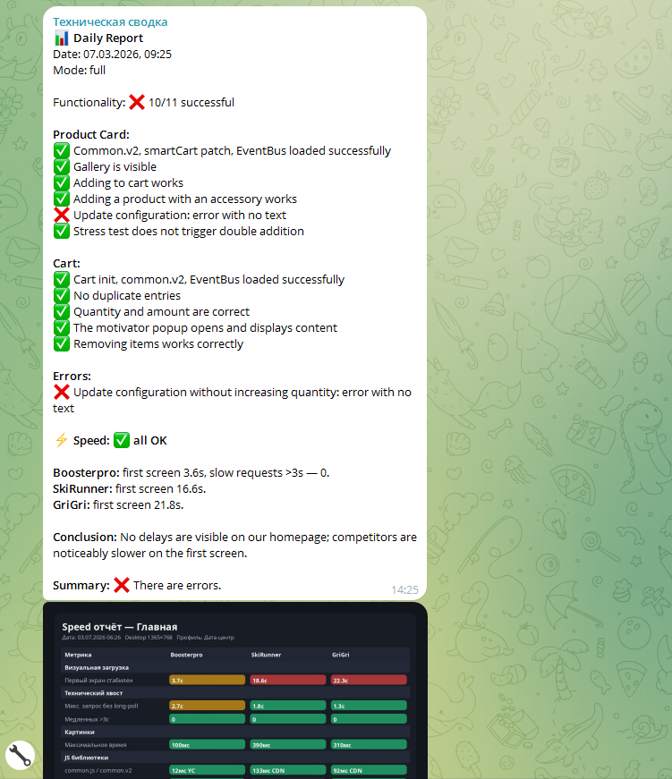
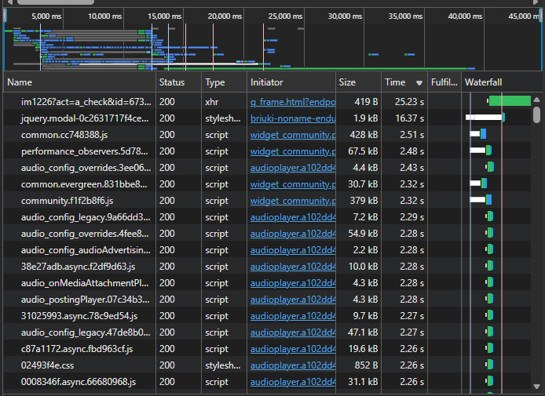
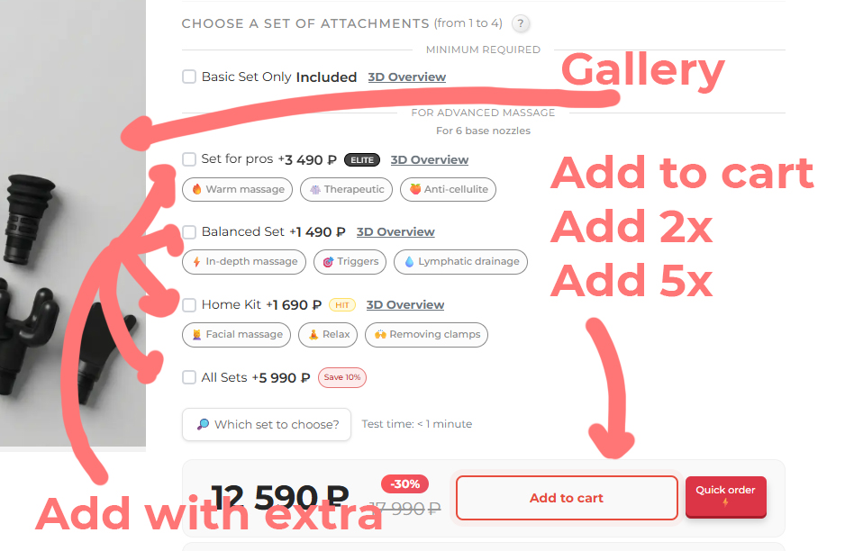

# Ecom Tech Speed Checker

A lightweight n8n-based monitoring template for ecommerce websites.

It runs scheduled technical checks, sends Telegram reports, and helps detect issues that regular uptime monitoring often misses: broken product pages, cart problems, failed add-to-cart flows, duplicated cart lines, slow first-screen rendering, and failed speed reports.

The project is designed for ecommerce owners, developers, technical marketers, and small teams who need a practical daily health report without building a full monitoring infrastructure from scratch.

Instead of only checking whether a website is online, this workflow checks whether the key buying path still works:

- product page is loaded correctly
- product gallery is visible
- add-to-cart flow works
- product with accessory/bundle can be added
- cart page initializes correctly
- cart totals and quantities look valid
- duplicate cart lines are not created
- cart item removal works
- speed runner returns a visual performance summary
- Telegram report is sent automatically

The template is platform-agnostic. The runners are simple HTTP services and can be deployed to any Docker-friendly platform such as Yandex Cloud Serverless Containers, Google Cloud Run, AWS App Runner, Azure Container Apps, Render, Railway, Fly.io, or a VPS with Docker.



## What problem does it solve?

Most uptime monitors only answer one question: “Is the website responding?”

For ecommerce, that is not enough.

A store can be technically online while the actual buying flow is broken. Product pages may load with JavaScript errors, the gallery may disappear, the add-to-cart button may stop working, cart totals may be wrong, bundled products may duplicate lines, or the first screen may become slow enough to hurt conversions.

These issues are often noticed too late — after ads are already running, traffic is coming in, and sales suddenly drop.

This template helps catch such problems earlier by running practical checks against the real user flow and sending a clear Telegram report.

It is useful when you want to know:

- whether the product page still works after theme changes
- whether cart logic still works after custom JavaScript updates
- whether add-to-cart actions behave correctly
- whether product bundles or accessories create duplicate cart lines
- whether cart totals and quantities look valid
- whether basic performance has degraded
- whether scheduled checks completed successfully

The goal is not to replace full observability platforms, but to provide a simple technical safety net for small and medium ecommerce projects.



## Who is it for?

This template is useful for teams and solo operators who run ecommerce websites and need a simple way to detect technical problems before they affect sales.

It is especially suitable for:

- ecommerce store owners who want a daily technical report without manually checking the site
- developers who maintain custom themes, cart logic, product pages, or JavaScript-heavy storefronts
- technical marketers who run paid traffic and need to know if the buying path is working
- agencies that support multiple ecommerce clients
- small teams that do not need a full observability stack, but still want practical monitoring
- solo founders who want to be notified when something important breaks

The template is not tied to a specific ecommerce platform. It can be adapted for InSales, Shopify, WooCommerce, custom storefronts, or any website where the key user flow can be checked through browser automation and HTTP runners.

## What does it check?

The template is built around two types of checks: health checks and speed checks.

### Health checks

Health checks verify that the main ecommerce flow still works from the user’s point of view.

By default, the workflow can check:

- product page availability
- product gallery visibility
- basic JavaScript sanity checks
- add-to-cart flow
- adding a product with an accessory or bundle
- accessory update without creating duplicate cart lines
- double-click protection for add-to-cart actions
- cart page initialization
- cart line duplication issues
- cart quantity and total validation
- cart motivator or promotional popup behavior
- cart item removal

These checks are useful after theme updates, custom JavaScript changes, ecommerce platform updates, product page edits, or any changes that may affect the buying path.



### Speed checks

Speed checks run a browser-based performance test and return a compact summary.

The speed runner can report:

- first-screen visual loading time
- slow requests
- slowest request timing
- basic competitor or reference-page comparison
- speed status for the Telegram report
- optional PNG summary table

The goal is not to replace Lighthouse or full RUM analytics. The goal is to quickly understand whether the storefront became noticeably slower and whether the issue is visible enough to require attention.

### Telegram report

The workflow sends a Telegram report with:

- overall status
- health check summary
- failed or warning checks
- speed summary
- final result
- optional PNG speed report

This makes the monitoring result easy to review without opening n8n, server logs, analytics tools, or browser devtools.

## How it works

The workflow is built around n8n and two external HTTP runners.

n8n is responsible for orchestration:

1. starts the check on schedule or by Telegram command
2. prepares project configuration
3. sends payloads to the health runner and speed runner
4. normalizes runner responses
5. builds a human-readable Telegram report
6. sends the final text report and optional PNG speed summary

The runners do the actual technical work.

### Health runner

The health runner checks the ecommerce user flow with browser automation.

It opens configured pages, checks selectors, evaluates frontend state, performs cart actions, and returns a structured JSON result to n8n.

### Speed runner

The speed runner runs a browser-based speed test for the configured page.

It returns a JSON summary for the Telegram report and can also generate a PNG table with visual performance results.

### Telegram

Telegram is used as the reporting interface.

The workflow supports both scheduled reports and manual commands:

- `/report` — full report
- `/health` — health checks only
- `/speed` — speed checks only
- `/help` — command list

This keeps the setup simple: n8n handles the logic, runners handle website checks, and Telegram receives the final result.

## Architecture

```text
Telegram command or n8n schedule
        |
        v
n8n workflow
        |
        |-- prepares project config
        |-- decides which checks to run
        |
        +--> Health runner HTTP endpoint
        |        |
        |        +--> browser automation
        |        +--> product/cart checks
        |        +--> JSON result
        |
        +--> Speed runner HTTP endpoint
                 |
                 +--> browser-based speed check
                 +--> JSON summary
                 +--> optional PNG report

        |
        v
n8n normalizes results
        |
        v
Telegram report
```

The workflow itself does not depend on a specific hosting provider.

The health runner and speed runner are plain Docker-based HTTP services. They only need a public HTTPS endpoint that n8n can call.

## Deployment options

The runners can be deployed to any platform that supports Docker containers and public HTTP endpoints.

Yandex Cloud Serverless Containers is the currently tested option for this project, but it is not required. The same approach can be adapted to other serverless container platforms or to a regular VPS.

| Platform | Good for | Why use it |
|---|---|---|
| Yandex Cloud Serverless Containers | Russia/CIS projects, current tested setup | Already tested with this workflow. Good option if your infrastructure, billing, or target region is close to Yandex Cloud. |
| Google Cloud Run | General international deployment | A strong default option for Docker-based HTTP services. Suitable for running containerized HTTP endpoints without managing servers directly. |
| AWS App Runner | AWS-based teams | Useful if your project is already in AWS and you want a managed way to run containerized web apps and APIs. |
| Azure Container Apps | Microsoft/Azure-based teams | Good fit if your infrastructure is already in Azure and you want serverless containers with managed scaling. |
| Render | Simple deployment for small projects | Easier than large cloud platforms, especially for prototypes and small teams. Check timeout, sleep, and pricing limits before using it for production checks. |
| Railway | Fast setup for experiments | Convenient for quick Docker deployments and testing. Check usage limits, uptime behavior, and pricing before relying on it for production monitoring. |
| Fly.io | Region-aware lightweight apps | Useful when you want to deploy small containerized services closer to selected regions. |
| VPS with Docker | Maximum control | Most predictable option if you are comfortable managing a server yourself. Requires more manual maintenance, but avoids some serverless timeout and cold-start issues. |

For browser-based runners, make sure the platform supports:

- Docker images
- enough memory for Chromium or Playwright
- public HTTPS endpoints
- request timeout long enough for the check
- logs for debugging failed runs

The workflow only needs the final runner URLs:

```text
health_runner_url
speed_json_url
speed_image_url
```

These URLs are configured inside the `Build Report Config` node in n8n.

## Project structure

Recommended repository structure:

```text
ecom-tech-speed-checker/
├── README.md
├── RUNBOOK.md
├── n8n/
│   └── tech-checker-template.json
├── health-runner/
│   ├── Dockerfile
│   ├── requirements.txt
│   └── app.py
└── speed-runner/
    ├── Dockerfile
    ├── requirements.txt
    └── app.py
```

### `n8n/`

Contains the n8n workflow template.

The workflow is responsible for scheduling, Telegram commands, preparing config, calling runners, normalizing responses, and sending the final Telegram report.

### `health-runner/`

Contains the HTTP service that checks the ecommerce buying flow.

It is responsible for browser automation, product page checks, cart checks, add-to-cart actions, and returning a structured JSON result.

### `speed-runner/`

Contains the HTTP service that runs browser-based speed checks.

It returns a JSON summary for the Telegram report and can generate a PNG speed summary table.

### `RUNBOOK.md`

Contains operational notes: how to rebuild runners, redeploy containers, test endpoints, and debug failed checks.

## Requirements

To use this template, you need:

- an n8n instance
- a Telegram bot
- Telegram credentials connected in n8n
- a Telegram chat or group where reports will be sent
- deployed health runner HTTP endpoint
- deployed speed runner JSON endpoint
- deployed speed runner PNG endpoint
- a test product page URL
- a cart page URL
- selectors and expectations configured for your storefront

The workflow expects three runner URLs:

```text
health_runner_url
speed_json_url
speed_image_url
```

These URLs are configured in the `Build Report Config` node.

You also need a Telegram chat ID for scheduled reports. Manual Telegram commands use the chat ID from the incoming Telegram message automatically.

For scheduled reports, set the chat ID in the `Normalize Run` node:

```js
const REPORT_CHAT_ID = 'TELEGRAM_CHAT_ID_HERE';
```

Replace `TELEGRAM_CHAT_ID_HERE` with your real Telegram chat ID after importing the workflow into your own n8n instance.

Do not commit real chat IDs, runner URLs, tokens, credentials, or project-specific product IDs to a public repository.

## Quick start

1. Import the n8n workflow:

```text
n8n/tech-checker-template.json
```

2. Connect your own Telegram credentials in all Telegram nodes.

3. Set the scheduled report chat ID in the `Normalize Run` node:

```js
const REPORT_CHAT_ID = 'TELEGRAM_CHAT_ID_HERE';
```

4. Fill project settings in the `Build Report Config` node:

```text
project_slug
project_name
base_url
product_path
cart_path
health_runner_url
speed_json_url
speed_image_url
selectors
expectations
```

5. Test Telegram commands:

```text
/help
/speed
/health
/report
```

6. Enable the schedule only after manual `/report` works correctly.

For detailed configuration, see `CONFIGURATION.md`.

## Telegram commands

The workflow supports manual Telegram commands:

| Command | Description |
|---|---|
| `/report` | Runs full report: health checks and speed checks |
| `/health` | Runs health checks only |
| `/speed` | Runs speed checks only |
| `/help` | Shows available commands |

Scheduled reports run automatically according to the `Schedule Trigger` node.

## Configuration

Most project-specific settings are stored in one n8n node:

```text
Build Report Config
```

This node contains:

- project name and base URL
- product and cart paths
- runner endpoint URLs
- selectors for storefront checks
- cart and accessory expectations
- health and speed timeouts

The template is intentionally shipped with empty configuration values.

This makes it safer to publish and easier to adapt for another ecommerce project.

Detailed setup instructions are available in:

```text
CONFIGURATION.md
```

## Security notes

Do not commit real secrets or project-specific private data to a public repository.

Before publishing your workflow, check that it does not contain:

- Telegram bot tokens
- Telegram chat IDs
- n8n credentials
- private runner URLs
- internal product IDs
- customer data
- real order data
- private screenshots or logs

The provided workflow template does not require credentials to be stored in the JSON file. After importing the workflow into n8n, connect your own Telegram credentials manually.

For a detailed checklist, see `SECURITY.md`.

## Limitations

This project is a practical ecommerce monitoring template, not a full observability platform.

It does not replace:

- real user monitoring
- analytics systems
- error tracking tools
- full synthetic monitoring platforms
- infrastructure monitoring
- server logs
- payment provider monitoring

The goal is different: to provide a simple daily technical safety net for the most important ecommerce user flow.

The checks may need adaptation for each storefront because themes, cart behavior, selectors, bundled products, and ecommerce platforms differ.

## Roadmap ideas

Possible future improvements:

- multi-product checks
- multi-region speed checks
- screenshot on failed health check
- failed request collection
- console error collection
- Slack or Discord reports
- GitHub Actions deployment examples
- Google Cloud Run deployment guide
- Docker Compose example for VPS deployment
- configurable competitor/reference pages
- historical report storage

## Contributing

Contributions are welcome.

Useful contributions include:

- deployment examples
- runner improvements
- new ecommerce platform adapters
- better documentation
- bug fixes
- additional health checks
- safer default configuration examples

If you adapt this project for another ecommerce platform, consider opening a pull request with notes or examples.

## License

MIT License.

You can use, modify, and adapt this project for personal or commercial ecommerce monitoring.
